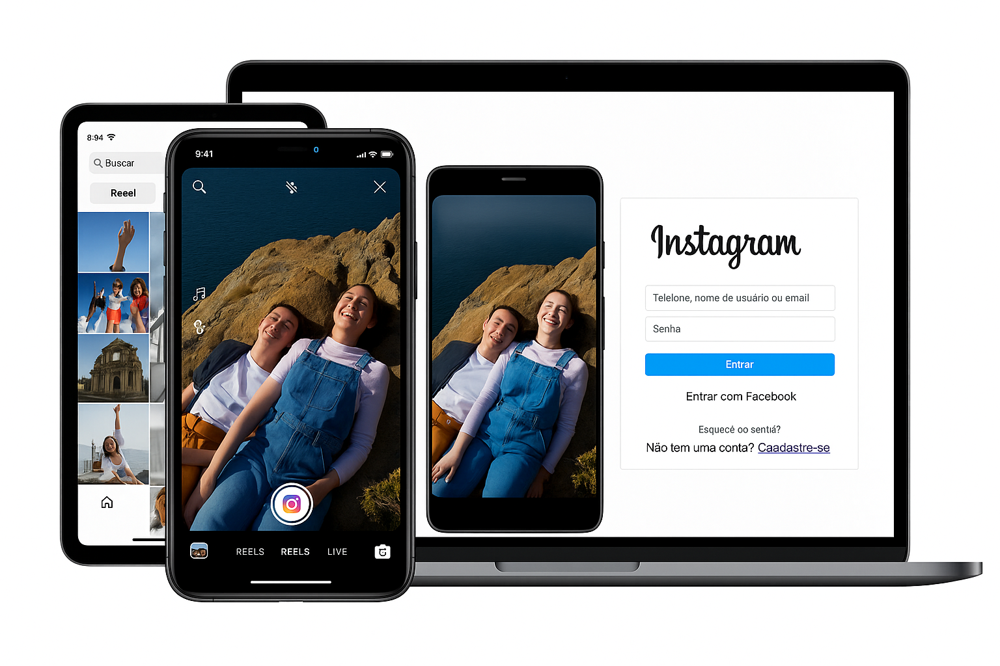

# Clone do Instagram

Este projeto é uma recriação da página de login do Instagram, desenvolvido com o objetivo de praticar e demonstrar habilidades em desenvolvimento web front-end.

## Demo

🔗 **[Acessar demo na Vercel](https://project-instagram-diegovieiradv.vercel.app)**

🎨 Preview do Projeto

<div align="center">



_Interface moderna e responsiva em todos os dispositivos_

</div>

O projeto consiste em uma página responsiva que replica a interface de login do Instagram, incluindo:

- Layout similar à página oficial do Instagram
- Formulário de login
- Área de visualização do aplicativo móvel
- Design responsivo para diferentes tamanhos de tela

## Tecnologias Utilizadas

- **HTML5** - Estruturação semântica da página
- **CSS3** - Flexbox, Media Queries, responsividade
- **JavaScript** - Animação de troca de imagens

## Como Executar

1. Clone este repositório:

```bash
git clone https://github.com/diegovieiradv/project-instagram.git
```

2. Abra o arquivo `index.html` em seu navegador

## Recursos

- Interface fiel à página de login do Instagram
- Formulário de login estilizado
- Visualização do aplicativo móvel (em telas maiores)
- Layout responsivo que se adapta a diferentes dispositivos
- Animação de troca de imagens automática

## Licença

Este projeto está sob a licença MIT. Veja o arquivo [LICENSE](LICENSE) para mais detalhes.
